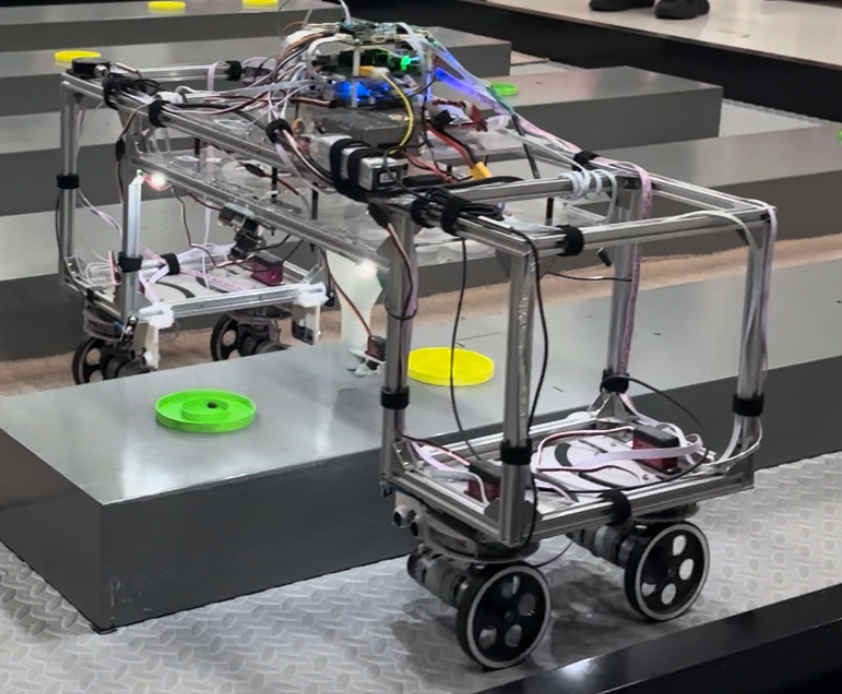
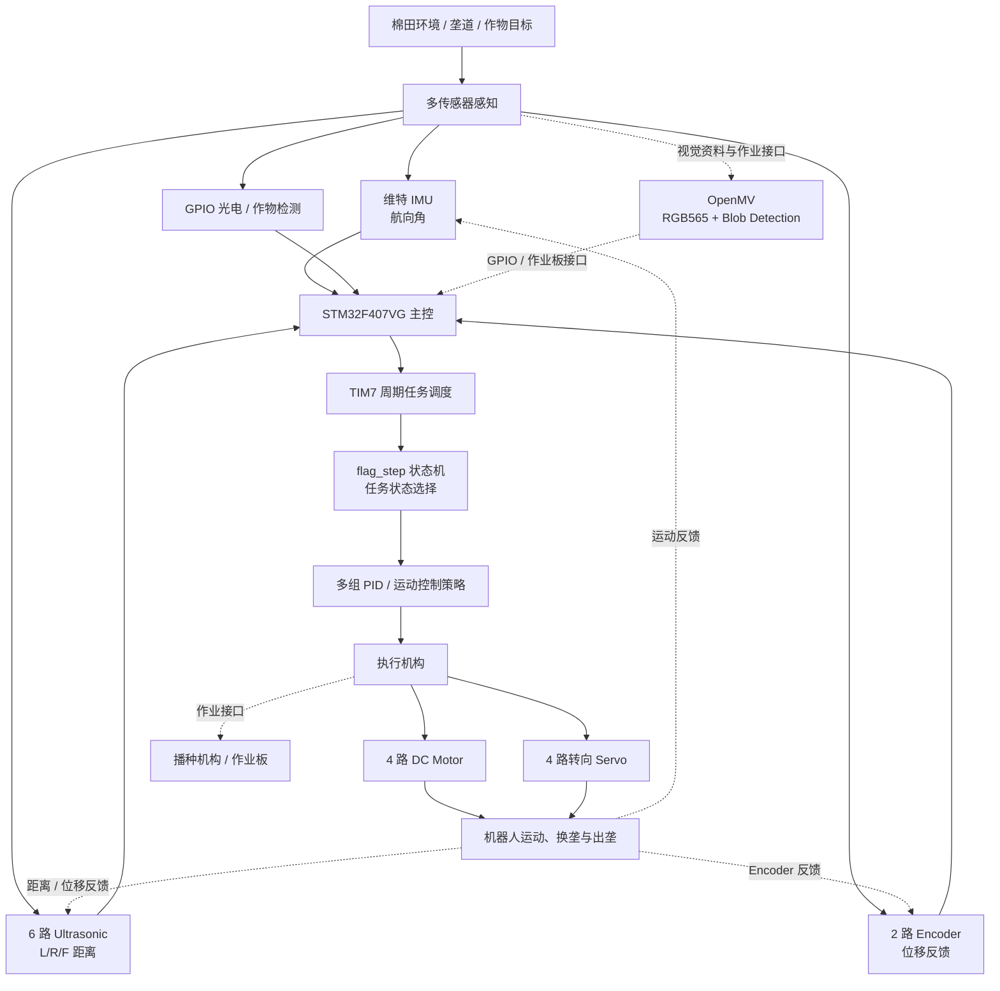
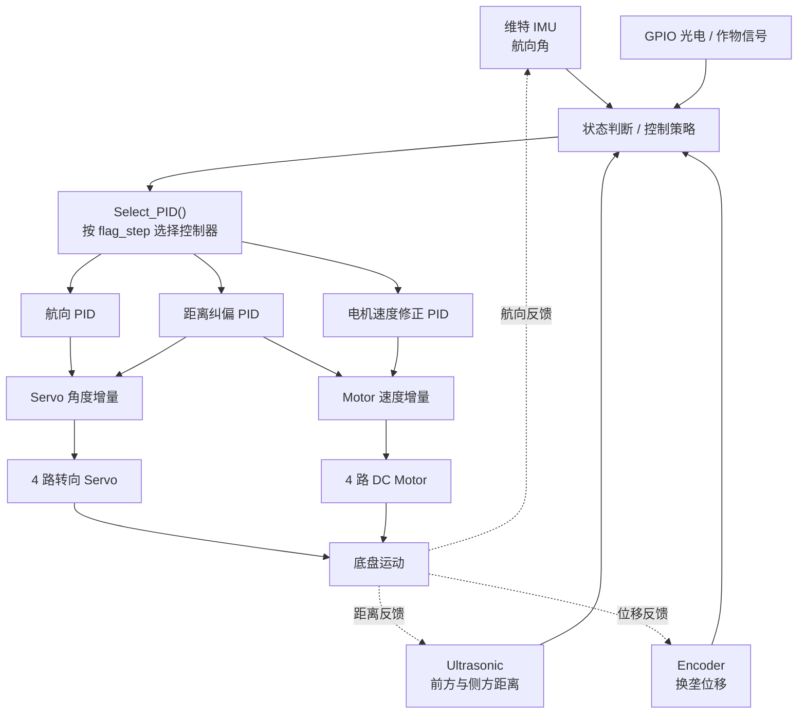
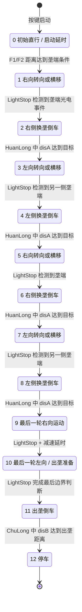

# 棉花变量播种机器人

Cotton Variable Seeding Robot

本项目面向棉花田间变量播种作业，构建了一套由移动底盘、距离与姿态感知、闭环运动控制、OpenMV 视觉节点、播种机构以及 PCB/机械设计资料组成的农业机器人系统。主控侧以 `STM32F407VG` 为核心，通过维特 IMU（WitMotion IMU）、6 路 Ultrasonic、2 路实际参与控制的 Encoder、GPIO 光电/作物检测信号和状态机、多组 PID，实现直行纠偏、垄端判断、换垄、出垄与停车等运动任务。



▶ [点击观看棉花变量播种机器人实机演示](https://www.bilibili.com/video/BV1jCyhB8EZ5/)

## 项目简介

这个仓库不是单一的 MCU 示例程序，而是一个包含嵌入式控制、机器视觉、控制 PCB 和车体/播种机构设计资料的完整机器人项目。当前仓库中可以直接追踪的 Keil 工程位于 `CODE/USER/Prayer.uvprojx`，目标器件为 `STM32F407VG`，其运动控制主链包括：

- `TIM7` 周期中断调度任务；
- 维特 IMU 提供航向角反馈；
- 6 路 Ultrasonic 提供前方、左侧和右侧距离信息；
- TIM3/TIM5 对应的两路 Encoder 累计换垄位移；
- 4 路 DC Motor 和 4 路转向 Servo 执行底盘运动；
- `flag_step` 状态机选择不同的行驶、转向、换垄和出垄策略；
- OpenMV 通过颜色阈值与 Blob Detection 输出视觉/作业侧信号；
- `PCB板/` 与 `SOLIDWORKS 车体零件/` 保存控制板、车体、支架和播种机构资料。

## 技术栈与系统边界

| 模块 | 本仓库可核实的实现 |
| --- | --- |
| 主控 | `STM32F407VG`：`CODE/USER/Prayer.uvprojx` 的完整 Keil 工程目标 |
| 姿态感知 | 维特 IMU（WitMotion IMU）；主控通过 `USART2` 接收姿态数据并提取航向角 |
| 距离感知 | 6 路 Ultrasonic：`L1/L2`、`R1/R2`、`F1/F2`，使用 `TIM2` 与 `TIM9` 输入捕获 |
| 运动反馈 | 2 路实际被主程序初始化和读取的 Encoder：`TIM3`、`TIM5` |
| 边界/作物检测 | `LeftLight`、`RightLight` 两路 GPIO 信号，以及用于减速判断的 `PE15` GPIO 输入 |
| 视觉 | OpenMV：`RGB565`、`QVGA`、ROI、颜色阈值、均值滤波、Blob Detection |
| 底盘执行 | 4 路 DC Motor：`TIM1` 四通道 PWM + 方向 GPIO |
| 转向执行 | 4 路实际由 `Servo_Set_Angle()` 写入的转向 Servo：`TIM4` 四通道 PWM |
| 控制策略 | `flag_step` 状态机 + 航向 PID + 距离/纠偏 PID + 电机速度修正 |
| 工程资料 | Keil 工程、STM32 Standard Peripheral Library、OpenMV 脚本、PCB 工程压缩包、SolidWorks/SLDPRT/STL/DWG/DXF 文件 |

> 说明：PCB 资料和 `PCB板/TIPS.txt` 还提供了 `STM32F103RCT6` 作业板的证据，但仓库中没有找到对应的独立 Keil 源码工程。因此本文把它作为作业板/硬件资料证据说明，不把它包装成已由软件源码完整验证的第二套控制器。

## 项目亮点

- 使用 `STM32F407VG` 承担整车运动控制，`TIM7_IRQHandler()` 将状态判断、控制器选择、PWM 更新和 Ultrasonic 触发组织为周期任务。
- 维特 IMU 提供机器人航向角，主控以相对启动航向为目标，在直行、左右转向和倒车换垄阶段切换不同的航向控制器。
- 6 路 Ultrasonic 通过定时器输入捕获得到距离值，并经过限幅和均值滤波后参与垄端识别、侧向纠偏和换垄控制。
- 代码实际使用两路 Encoder 的累计位移完成换垄距离判断，避免把硬件资料中可能存在的编码器配置直接等同于当前固件使用数量。
- 多组 PID 分别面向航向、前方/侧方距离、转向 Servo 和电机速度修正，并根据 `flag_step` 选择当前作业状态所需的控制器。
- 4 路驱动电机、4 路转向 Servo、Ultrasonic、Encoder、光电信号和视觉/作业接口共同构成可追踪的机电闭环。
- OpenMV 采用轻量级颜色阈值与 Blob Detection，不依赖神经网络或深度学习模型。
- 仓库同时保留控制 PCB、车体连接板、Ultrasonic 支架、光电对管支架、Y 型作业机构、漏斗和作业机构上转盘等工程资料。

## 系统总体架构



图中的实线表示可以在当前 STM32F407 运动控制源码中直接追踪的链路；虚线表示仓库提供的 OpenMV、PCB 和播种机构资料与 GPIO/作业接口，但当前仓库没有提供完整的独立作业板固件和实车接线表。

## 实时控制与任务调度

`main.c` 的初始化顺序体现了主控的软件启动边界：Key、IO、LED、Servo PWM、Ultrasonic、OLED、Motor、`TIM7`、Encoder、PID 和 `USART1/USART2` 依次初始化。按下启动按键后，程序记录当前航向作为任务参考，写入各组航向 PID 的 `desired`，再置位 `flag_mission_start` 开始自动作业。

`TIM7_IRQHandler()` 内部使用多个软件计数器组织不同时间尺度的任务：

- 约 5 ms 控制分支：调用 `Detect_Flag_Step()`、`Detect_Flag_Slowdown()`、`Select_Servo_Angle()`、`Select_Motor_Speed()` 和 `Select_PID()`，随后统一写入 Servo 和 Motor 输出；
- 约 25 ms 触发一次 `Ultra_Trig()`，依次给 6 路 Ultrasonic 发送触发脉冲；
- 200 ms、500 ms、1000 ms、启动延时等标志用于状态切换后的停顿和减速节奏；
- OLED 实时显示航向、当前 `flag_step` 以及 6 路距离值，便于调试现场状态。

这种结构使“感知更新、状态判断、控制器选择、执行器更新”集中在固定周期内完成，而不是在主循环中用单一的 `Sensor → MCU → Motor` 直连逻辑表达。

## 运动控制系统

### 控制闭环



### PID 的系统级分工

`pid.c` 中的 `PidObject` 统一保存目标值、误差、积分分离、积分限幅、微分项和输出限幅。README 只按控制目标进行抽象，不逐一罗列所有历史对象名：

- 航向闭环：直行、右向运动、左向运动、慢速转向、倒车和出垄阶段分别使用不同的航向 PID，将误差转换为 Servo 角度增量或四个电机的差速修正；
- 距离闭环：使用前方或侧方 Ultrasonic 距离与目标距离的误差，调整转向 Servo，使车体保持在目标通道/垄道关系中；
- 换垄闭环：在 `HuanLong()` 中使用 Encoder 的 `disA/disB` 作为位移判据，配合倒车电机方向、Servo 姿态和状态切换完成横向换垄；
- 电机速度闭环：PID 输出会叠加到 `SpeedL1/SpeedR1/SpeedL2/SpeedR2`，最终由 `Motor_Set_Speed()` 转换为四路 PWM 与方向信号；
- 状态相关控制：`Select_PID()` 根据 `flag_step` 决定当前使用航向、侧距、前距或换垄控制逻辑，避免所有阶段共用一组固定参数。

## 自动作业流程

源码中的 `flag_step` 不是单纯的数字流水号，而是对机器人作业动作的状态编码。按当前控制代码可还原为以下流程：



其中，`HuanLong()` 先让底盘倒车并读取两路 Encoder 的累计位移，达到当前状态对应的距离后停车、切换 Servo 姿态并进入下一状态；最后的 `ChuLong()` 使用另一方向的位移条件完成出垄并清除 `flag_mission_start`。

## 多传感器感知

### 维特 IMU

实际机器人使用维特 IMU。主控的 `USART2` 驱动接收固定长度姿态帧，检查 `0x55/0x53` 帧头后提取航向角数据，并减去启动时记录的 `start_YAW`，再根据初始朝向完成角度回绕。控制层中的历史变量和 PID 对象名称可能保留旧项目命名，但 README 按真实硬件统一写为维特 IMU（WitMotion IMU）。

### 6 路 Ultrasonic

`ultrasonic.h` 明确给出了六个测距通道：

- 左侧：`L1`、`L2`；
- 右侧：`R1`、`R2`；
- 前方：`F1`、`F2`。

`TIM2` 负责四路侧向回波输入捕获，`TIM9` 负责两路前向回波输入捕获。每一路根据上升沿/下降沿时间计算距离，并执行限幅和 `MeanFilterLimit()` 均值滤波。代码中的 `Ultra_Trig()` 依次触发六个通道；PCB 资料也特别提醒不要同时开启六路，以降低声波串扰。

### Encoder

当前 F407 主程序只调用：

- `TIM3_EncoderB_Init()`；
- `TIM5_EncoderA_Init()`；
- `Read_Encoder_Cnt()`。

`Encoders` 结构体保存 `cntA/cntB`、速度和累计位移 `disA/disB`。在换垄状态中，`disA` 和 `disB` 被清零并重新累计，用于判断横向移动和出垄距离。因此 README 写“2 路实际软件反馈”，不把历史 README 中的“4 encoders”当作当前固件事实。

### GPIO 光电与按键

`LeftLight` 和 `RightLight` 由两个 GPIO 输入宏提供，`LightStop()` 根据信号的边沿历史判断垄端事件；`PE15` 被读取为作物/颜色减速信号，在特定转向状态中触发 `Motor_SlowDown()`。此外，4 个按键用于启动、调试和手动操作，OLED 显示当前航向、状态和距离值。

仓库中还存在 `TFLuna` 驱动，但其 `LASER` 宏为关闭状态，当前 README 不把它列为已启用的主感知链路。

## 机器视觉

OpenMV 目录提供两份按左右位置命名的脚本：`RIGX.txt` 和 `LEFX.txt`。两份脚本都体现了以下视觉处理链：

1. 使用 `RGB565`、`QVGA`，关闭自动增益和自动白平衡；
2. 在 ROI 内分别使用绿色和黄色 `Color Threshold`；
3. 对图像做一次均值处理，并调用 `find_blobs()`；
4. 从候选 Blob 中选择最大色块，输出颜色和“多个色块”状态；
5. 通过 OpenMV 的 `P4/P5/P6` GPIO 输出二值信号。

这是一套基于颜色阈值和 Blob Detection 的轻量级视觉方案，不应描述为 AI、Deep Learning 或神经网络目标检测。目录中另有 `2022DFH（森哥）.txt` 历史版本，其中包含 `UART3` 和数据打包函数，但当前代码中的发送调用被注释，不能直接当作当前实机的串口视觉通信链路。

## 播种执行机构

播种部分在仓库中以“视觉脚本 + 作业接口 + PCB 资料 + 机械资料”的形式出现：

- OpenMV 脚本输出颜色/色块状态，供作业侧使用；
- F407 控制代码中的 `Detect_Flag_Mv()` 根据当前运动状态和左右光电信号驱动 `PE7/PE8` 作业接口；
- `PCB板/ProProject_智能农装大赛_2024-05-16.zip` 与 `PCB板/TIPS.txt` 提供了作业板资料，资料中出现 `STM32F103RCT6`；
- `SOLIDWORKS 车体零件/` 包含 Y 型作业机构、漏斗、作业机构上转盘、光电对管支架和相关 STL/SLDPRT 文件。

当前仓库没有找到 STM32F103 作业板对应的独立 Keil 源码，也没有一条从视觉输出到播种 Servo/转盘的完整可编译调用链。因此，本节展示已存在的系统集成证据，同时明确不把缺失的板间控制细节包装成当前 F407 工程已经完全实现的功能。

## 硬件与机械设计

仓库包含以下非纯软件工程资料：

- `PCB板/`：嘉立创 EDA 专业版工程压缩包及打开说明；资料文本中同时可见主控板 `STM32F407VGT6` 与作业板 `STM32F103RCT6` 的硬件证据；
- `SOLIDWORKS 车体零件/`：车体连接板、Ultrasonic 支架、光电对管支架、亚克力板图纸、Y 型作业机构、漏斗和上转盘等模型/加工文件；
- `c1.png`：机器人实机照片；
- `CODE/USER/Prayer.uvprojx`：可在 Keil 中打开的 STM32F407 主控工程。

PCB 目录中的说明还记录了六路 Ultrasonic 的串扰注意事项、作业板供电/端子约束以及实车接线可能与板上丝印存在差异。README 因此只使用源码和资料共同能证明的系统级表述，不把 PCB 丝印直接当作软件调用关系。

## 软件结构

```text
CODE/
├── CORE/                  # CMSIS Cortex-M4 头文件与启动文件
├── DMP/                   # 历史惯性传感器算法/协议相关资料
├── FWLIB/                 # STM32F4 Standard Peripheral Library
├── HARDWARE/
│   ├── ENCODER/           # Encoder 初始化、计数、位移与速度处理
│   ├── MOTOR/             # 四路电机 PWM 与方向控制
│   ├── SERVO/             # Servo PWM 与角度输出
│   ├── ULTRASONIC/        # 六路 Ultrasonic 触发与输入捕获
│   ├── USART*_DMA/        # USART DMA 收发驱动
│   ├── TIMER7/            # 周期调度定时器
│   ├── IO/                # 作业接口和 GPIO 输入/输出
│   ├── wit_c_sdk/         # 维特传感器协议 SDK 资料
│   ├── TFLUNA/            # TFLuna 驱动（当前宏配置未启用）
│   └── ...
├── OBJ/                   # Keil 编译生成的目标文件与报告
├── SYSTEM/
│   ├── CONTROL/           # 状态机、任务策略、行驶/换垄/出垄控制
│   ├── PID/               # PID 对象、更新算法和控制量映射
│   ├── delay/             # 延时服务
│   └── sys/               # 系统底层初始化
└── USER/
    ├── main.c             # 主程序、外设初始化和任务启动
    └── Prayer.uvprojx     # Keil 工程文件，目标为 STM32F407VG

摄像头识别代码（openmv）/
├── RIGX.txt               # 右侧命名的颜色识别脚本
├── LEFX.txt               # 左侧命名的颜色识别脚本
└── 2022DFH（森哥）.txt    # 历史版本，包含未启用的 UART 发送实现
```

目录结构保持项目原貌；本次维护只更新 README，不重命名、不移动、不清理源码或历史目录。

## 项目演示

▶ [点击观看：第九届农装 B 类国二获奖作品——棉花变量播种机器人](https://www.bilibili.com/video/BV1jCyhB8EZ5/)

## 项目成果

项目参加 **第九届国际大学生智能农业装备创新大赛**，获得 **全国二等奖**。相关竞赛要求可参考[官方竞赛页面](https://uiaec.ujs.edu.cn/news_show.php?id=190)。比赛背景是项目成果的一部分，但本 README 将重点放在机器人本体、控制链路和可验证的工程资料上。

## 仓库说明

- 本 README 按真实硬件将姿态感知写为维特 IMU（WitMotion IMU）；源码中的历史变量、PID 对象和目录名称不作为最终硬件架构依据。
- 主控软件证据以 `CODE/USER/Prayer.uvprojx`、`CODE/USER/main.c`、`CODE/SYSTEM/CONTROL/`、`CODE/SYSTEM/PID/` 和 `CODE/HARDWARE/` 中的实际调用关系为准。
- `STM32F103RCT6` 目前只有 PCB/作业板资料证据，未在仓库中找到同等完整的独立固件工程。
- OpenMV 目录有两份左右命名脚本，但当前仓库没有单独的摄像头部署清单和实车接线图；视觉节点的物理数量、主控归属和最终板间连接仍应以实车资料补充确认。
- `CODE/HARDWARE/` 中保留了多类历史驱动和编译产物；本 README 不把“目录存在”直接等同于“当前实机正在启用”。

## License

本仓库当前声明为 [MIT License](./LICENSE)。仓库内第三方库、器件厂商 SDK 和工具生成文件如带有独立许可或使用条件，应同时遵循其原始许可。
